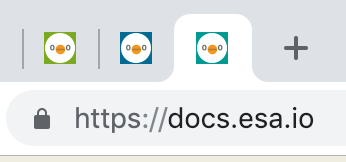

# [DEPRECATED]esa-colorful-favicon

2020-01-20 の esa のアップデートにより、本拡張は不要になりました！
[ReleaseNotes/2020/01/20/テーマカラーに連動してFaviconの色が変わるようになりました](https://docs.esa.io/posts/367)

[esa.io](https://esa.io) の favicon に背景色を追加します。
複数の esa のチームに参加している場合に便利です。
色は esa のテーマの色から取ってきます。

#### before

#### after

## インストール

[https://chrome.google.com/webstore/detail/esa-colorful-favicon/klbldcnfceelflhmdbbcgeojenigocff](https://chrome.google.com/webstore/detail/esa-colorful-favicon/klbldcnfceelflhmdbbcgeojenigocff)

## ライセンス

MIT.

## クレジット
アイコンは https://docs.esa.io/posts/125 を利用しています。
アイコンは © esa LLC にライセンスされます。
